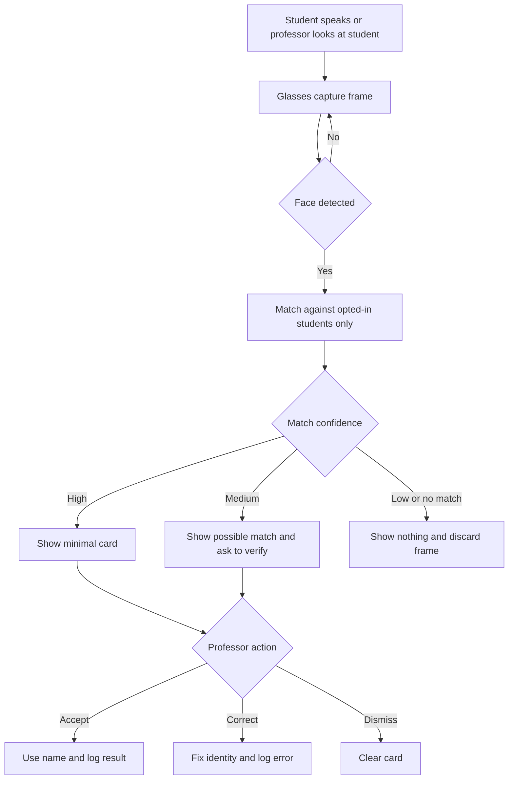
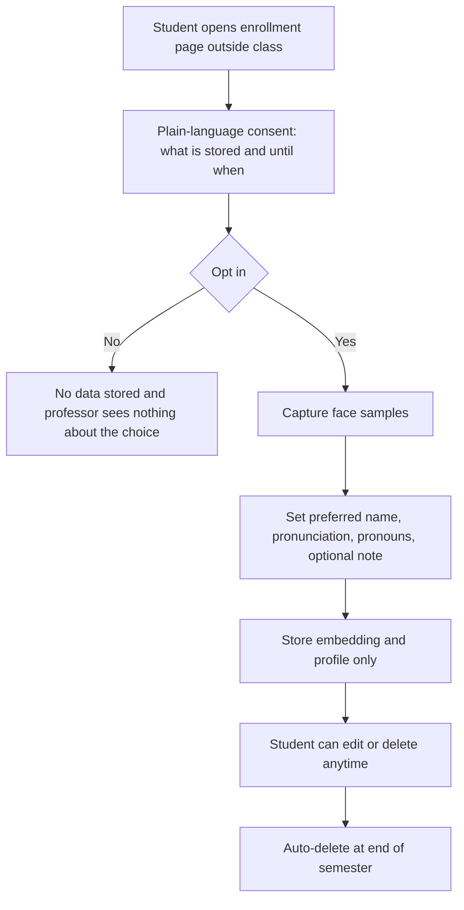

# Design Spec - ContextLens

**Owner:** Aman | **Status:** DRAFT. Replace `[FILL]` markers with details from
your interviews.

## 1. Design goal
Help a professor address students by their preferred name in under 2 seconds,
only for students who chose to opt in, without breaking eye contact and
without creating any record about students who did not.

## 2. Personas

**Dr. Rivera - Professor (wearer)**
- Teaches a 120-student lecture and a 20-student seminar
- Goal: call on students by name, pronounce names correctly, make students feel known
- Frustration: forgets names by week 3; mispronounces; feels distant from large classes
- Needs: glanceable card, zero typing, easy "that's wrong" correction, quiet when not needed

**Priya - Student who wants to be known (primary stakeholder)**
- 20, first-generation student, name often mispronounced, hesitant to speak in large lectures
- Goal: be addressed correctly and feel recognized
- Concern: doesn't want the professor tracking her or judging her by it
- From interviews: being known by name made students feel "seen" and "recognized"; international students often have names mispronounced and appreciate a professor's visible effort to learn them

**Marcus - Student who opts out (equal-treatment stakeholder)**
- 22, privacy-conscious, does not want his face processed
- Goal: opt out with zero consequences and no way for the professor to tell
- Needs: invisible opt-out, no penalty, deletion on request

**Sam - Course admin / TA**
- Manages enrollment lists, deletion requests, and the privacy statement
- Needs: a simple dashboard and an audit trail

## 3. Primary user journey (Dr. Rivera, lecture Q&A)

| Stage | Action | Thought | Pain | Opportunity |
|---|---|---|---|---|
| Question | Priya raises her hand | "Who is that?" | Can't recall name | Recognize enrolled students on look |
| Recognize | Card appears | "OK, name and how to say it" | Fear of confident wrong match | Confidence tier |
| Respond | "Priya, go ahead." | "That felt personal" | Glancing at a screen breaks rapport | One-line, minimal card |
| Correct | Wrong card shown | "That's not her" | Errors repeat | One-gesture correction + logging |
| Close | Card clears | "Back to the lecture" | Clutter lingers | Auto-dismiss |

## 4. Student journey (Priya, enrollment)
| Stage | Action | Thought | Pain | Opportunity |
|---|---|---|---|---|
| Learn | Reads course site explanation | "What exactly is stored?" | Vague policies | Plain-language screen |
| Decide | Chooses to opt in (or not) | "Will this affect my grade?" | Power gap | No-penalty statement, professor can't see decliners |
| Enroll | Takes selfie, sets preferred name/pronunciation/pronouns | "I control this" | Too many fields | Minimal profile |
| Maintain | Edits note or deletes data | "I can leave anytime" | Hard to find controls | Visible delete button |

## 5. Task flows

### 5.1 Recognition flow (in class)


### 5.2 Student enrollment and consent flow


## 6. Wireframes (professor's glasses HUD)

**State A - High confidence**
```
+------------------------------------+
|  Priya Shah  (she/her)       * 94% |
|  say: PREE-yah                     |
|  Last asked: capstone idea         |
|                                    |
|  [ OK ]      [ Not her ]   [ Hide ]|
+------------------------------------+
```

**State B - Medium confidence (ask, don't assert)**
```
+------------------------------------+
|  Possible match: Priya S.    ? 62% |
|  Verify before using               |
|                                    |
|  [ Yes ]     [ No ]        [ Hide ]|
+------------------------------------+
```

**State C - Not enrolled / opted out**
```
+------------------------------------+
|                                    |
|         (no card, no record)       |
|                                    |
+------------------------------------+
```

**Student enrollment screen (phone)**
```
+--------------------------------------+
| Be known by name (optional)          |
| Only your name info is shown to your |
| professor. No grades. No attendance. |
| Your choice is private.              |
|                                      |
| Preferred name: [ Priya          ]   |
| Pronunciation:  [ PREE-yah       ]   |
| Pronouns:       [ she/her        ]   |
| Note (optional):[ ask about ...  ]   |
|                                      |
| [ Opt in ]   [ No thanks ]           |
| You can delete this anytime.         |
+--------------------------------------+
```

**Classroom indicator (physical or slide)**
```
Glasses active: only students who opted in are recognized.
Everyone else is not stored.
```

## 7. Key interactions
| Interaction | Input | Result |
|---|---|---|
| Accept card | Tap / pinch / say "OK" | Logs positive |
| Reject match | Say "not her" or swipe | Clears card, logs error |
| Dismiss | Look away 3s or say "hide" | Clears card |
| Quiet mode | Say "quiet" | Cards only on request |
| Request card | Say "who's this" | Shows card on demand |
Rules: never speak a name aloud automatically; never show a card for a
non-enrolled student; every card has an escape.

## 8. Design-system choices
- **Color:** near-black `#101012`, lime accent `#D7FF5C`, text `#F2F2EF`, muted `#8A8A86`. Confidence: lime high, amber medium, none low.
- **Type:** Arial / system sans; name 24px bold, detail 18px regular on HUD.
- **Components:** recognition card, confidence chip, action buttons (max 3), toast, student enrollment form, admin table.
- **Constraints:** small field of view, glance under 2 seconds, max 3 lines, no scrolling.
- **Accessibility:** voice and gesture alternatives for every action; show percent, not color alone.

## 9. Ethics and safety guardrails
- Opt-in outside class time; no penalty; professor cannot see who declined.
- Data minimization: embedding plus the student's own profile fields only.
- Non-enrolled frames are discarded immediately and never stored.
- No linkage to attendance, grades, or behavior inference.
- Auto-delete at end of semester; delete on request anytime.
- Fairness testing across skin tones, lighting, and glasses/masks before any use.
- Students asked for clear access controls, secure storage, and knowing exactly who can see their data (see section 10).

## 10. Changes after interviews (n=2)

Evidence is in `validation/interviews/` and `validation/OPPORTUNITY_FRAMING.md`.

- **Richer, student-approved profile.** Both interviewees accepted *past
  questions/interactions*. Profile fields are now: preferred name,
  pronunciation, pronouns (optional), past questions the student approves,
  optional note, optional major/project. Each field is toggleable.
- **Learning mode.** Students value the professor's *effort* and one worried
  about over-reliance. The card shows a pronunciation coach and fades after
  repeated successful use, so the tool teaches rather than replaces.
- **Session-based activation.** Comfort varied by setting (lecture vs office
  hours vs hallway). Recognition runs only when the professor starts a session,
  with a visible indicator, and defaults to large lectures.
- **No-penalty guarantee.** The enrollment screen states: "Choosing no has no
  effect on your course experience. Your professor won't see your choice."
- **Transparency.** A "who can see my data" screen and an access log, plus a
  short demo from a student before the class adopts it.
- **Retention.** Data ends with the course term; deletion on request.

**Learning-mode card**
```
+------------------------------------+
|  Priya Shah                 seen 2/5|
|  say: PREE-yah   [ hear it ]       |
|  Last asked: capstone idea         |
|  Card fades as you learn the name  |
+------------------------------------+
```

**Updated enrollment fields (phone)**
```
Preferred name:   [ Priya        ]
Pronunciation:    [ PREE-yah     ]
Pronouns:         [ optional     ]
Share past questions with my professor:  [x]
Share major / project:                   [ ]
Choosing no has no effect on your course experience.
[ Opt in ]  [ No thanks ]   Delete anytime. Ends with the term.
```

**Contested by interviewees (not built):** attendance and grade linkage. One
student found it scary and one saw accuracy benefits, so it stays off by
default and out of scope.
